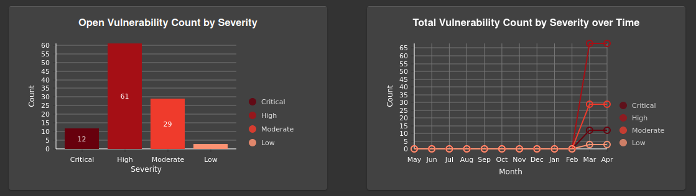
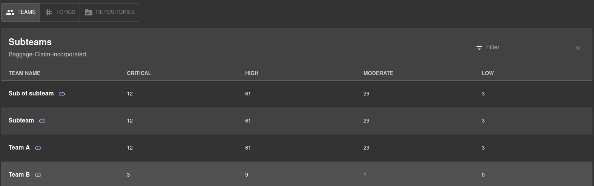
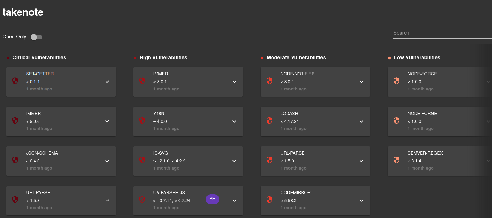
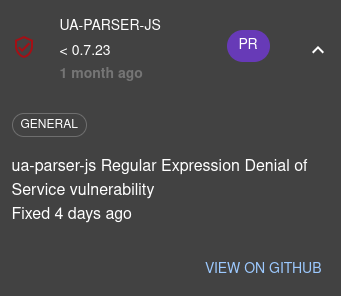

# dependabot-dashboard

Welcome to the `dependabot-dashboard` plugin!

The goal of this plugin is to make it easier to view and manage dependency vulnerabilities across an organization on Github. You can use this plugin to generate helpful graphs to analyze the health of your organization's code, and view how individual teams are handling their vulnerabilities.

Additionally, you can view all known vulnerabilities for a specific repository, and find the specific vulnerability alert from dependabot to patch the vulnerability.

## Prerequisites

- [GitHub Authentication Provider](https://backstage.io/docs/auth/github/provider) (With `read-only` permission granted for `Pull Requests`)

## Installation

This plugin needs to be added to an existing backstage instance.

```bash
# navigate to the plugins directory in Backstage
cd plugins/
# clone our repo into the plugins folder
git clone https://github.com/American-Capstones/TAMU-Spring-2023.git
cd TAMU-Spring-2023
# install the plugin's dependencies
yarn install
```

```bash
# navigate to backstage app directory
cd ../../packages/app
```

Add `"@internal/plugin-dependabot-dashboard": "^0.1.0"` within "dependencies" in package.json

```bash
cd src
```

Open App.tsx and add

`import { DependabotDashboardPage } from '@internal/plugin-dependabot-dashboard'`

Then add a new Route element to "routes"

`<Route path="/dependabot-dashboard" element={<DependabotDashboardPage />} />`

### To add a link to the sidebar:

You can add dependabot dashboard to your backstage instance's sidebar by adding a new `SidebarItem` element to `packages/app/src/components/Root/Root.tsx` with the property `to="dependabot-dashboard"`

## Usage

### Organization Select

The organization select allows you to select which organization you would like to view. This is useful if you belong to multiple organizations on Github.

### Organization Page

The organization view is the default view of the plugin. It shows a graph of the number of vulnerabilities from every repository in your organization, and a line graph showing how those vulnerability counts have changed over time.



The Organization page also provides dynamic table, that allows you to view the teams, topics, and repositories within your Github organization.



A **Team** refers to _the team which has worked on a repository_, so more than one team page could contain the same repositories. You can click on a team to go to the [Team Page](Team-Page) which shows the same graphs and table, scoped specifically to the data relevant to that team.

A **Topic** refers to the Github topic that is associated with a repository. Some of your organization's repositories could have a topic without a designated team, so this view is especially helpful to view those repos' trends. To view the [Topic Page](Topic-Page) you can click on a topic in the table.

A **Repository** refers to a Github repository that is assigned to the Github organization you selected. All repositories are available in this graph. You can click a repo name to go to the associated [Repository Page](Repository-Page) which shows the specific vulnerability alerts for that repository.

### Team Page

The team page allows you to view how specific teams are doing at handling their project's vulnerabilities. Just like the organization page, the teams page shows a bar graph, a line graph, and a table displaying every repository associated with the selected team. By offering the same types of graphs on this page, you can compare how a team is doing relative to the rest of an organization.

### Topic Page

Similar to the Team page, this view shows the stats from repositories that have the selected topic. It includes the same graphs and table that are on the Team page, scoped to consider topics instead of teams.

### Repository Page

The repository page shows a list of all the vulnerabilities that Dependabot has found for that repo, sorted into columns based on the severity of each vulnerability.

This page allows you to search for a given package name (since we _are_ talking about dependency vulnerabilities, after all) among the list of vulnerabilities. You can also choose to view only the "Open" vulnerabilities, which is a keyword chosen by dependabot to denote any alert that you have not closed or dismissed.



Each card on the repository page can be expanded, which gives the user more information about a vulnerability alert, containing a link to the original issue on Github and a link to a PR made by dependabot, if one exists.

<p align="center">
  
</p>

### Contributing and Reporting Issues

Contributions are welcome! If you have any ideas or suggestions for how to improve the dependabot-dashboard plugin, please feel free to submit a pull request. To get started, fork the repository, create a branch, make your changes, and then open a pull request.

If you encounter any issues while using the plugin, please report them on the [GitHub issue tracker](https://github.com/American-Capstones/TAMU-Spring-2023/issues). When submitting an issue, please include a clear description of the problem, any steps needed to reproduce it, and any relevant error messages.

We welcome feedback and are committed to making the dependabot-dashboard plugin the best it can be!!!
